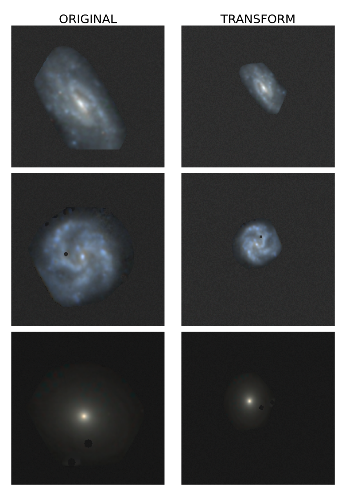
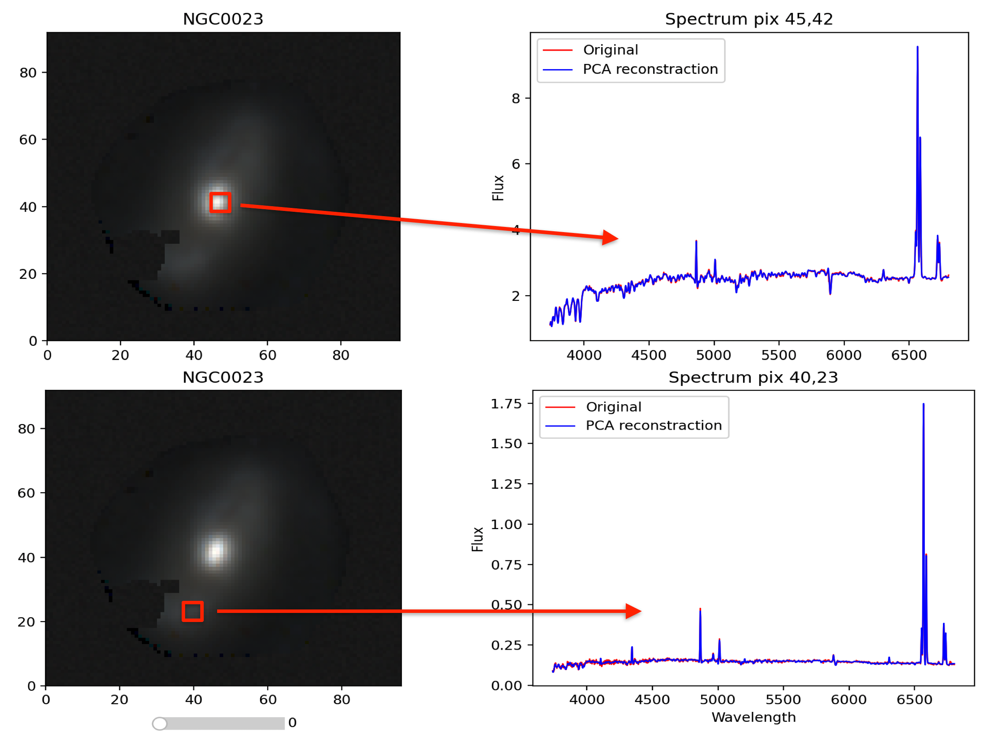
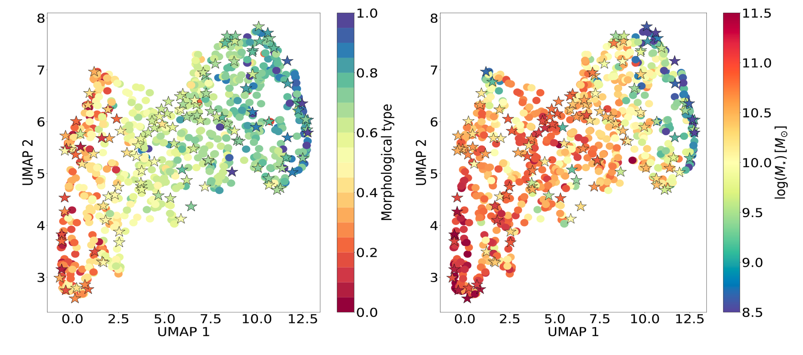
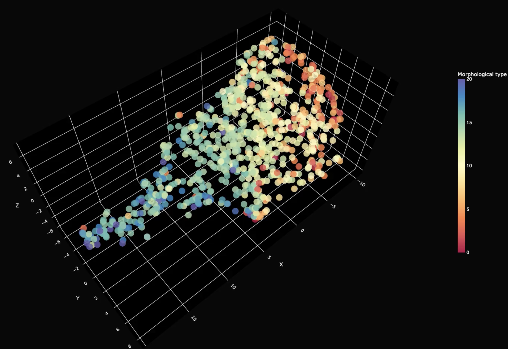

# Exploring Galaxy Properties of eCALIFA with Contrastive Learning

This repository contains a pipeline for processing and analyzing data using **Contrastive Learning (CL) on CALIFA surveys**.

## Features
The pipeline includes:

- **Training a SimSiam model**  
  The `train.py` script sets up and trains a contrastive learning model to learn representations of galaxy images.
  
- **Generating galaxy pairs**  
  The `generate_galaxy_pairs.py` script creates augmented galaxy pairs from CALIFA FITS cubes for contrastive learning.
  
- **Creating latent space projections**  
  The `create_latent_space.py` script computes **latent representations (embeddings)** of galaxies and their properties.

- **Configuration**  
  Use the `config.cfg` file to specify folder paths. To train the model, you need to download CALIFA datacubes from:  
  [https://califa.caha.es](https://califa.caha.es)

- **Pretrained Models and Embeddings**  
  The trained models can be found in the `models/` folder, and the generated embeddings are stored in `data/projections/`.

## **Results**
Here are some of the results obtained from the analysis. You can find more details in our paper: **G. Martínez Solaeche et al. (2024)**.

### **1️⃣ Original & Transformed Galaxy Images**  
This figure shows three galaxies in their original form alongside their transformed versions produced by the pipeline.

<p align="center">
  
</p>

### **2️⃣ Dimensionality Reduction with PCA**  
PCA is applied to reduce the dimensionality of CALIFA datacubes. With 30 components, we can reconstruct spectra of different spaxels, including star formation regions and AGN activity.

<p align="center">
  
</p>

### **3️⃣ UMAP Projection of Latent Space**  
The UMAP projection visualizes the learned latent space from the **SimSiam model**. Galaxies are color-coded based on their morphological type (left) and their stellar mass (right). We observe clear and complementary gradients in these properties, demonstrating that galaxies separate well according to their physical properties.

<p align="center">
  
</p>

---

## **Training Visualization**
The following video illustrates how the embedding space produced by the model evolves as the neural network learns to separate galaxies based on their similarities.

<p align="center">
  <a href="https://youtu.be/D6EdMDz58Qw">
    
  </a>
</p>

---

## **How to Use This Pipeline**
To train and analyze the data, follow these steps:

1. Clone the repository:
   ```bash
   git clone https://github.com/gimarso/CL_eCALIFA.git
   cd CL_eCALIFA
   
